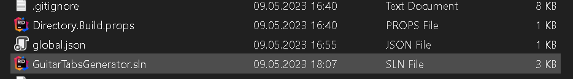
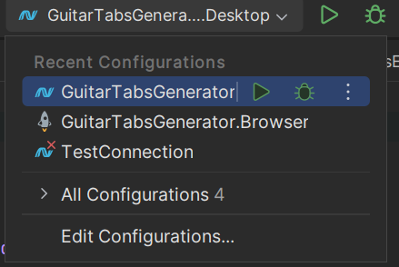
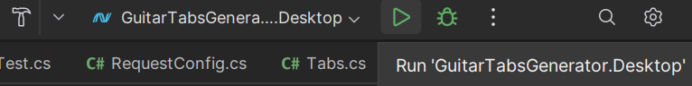
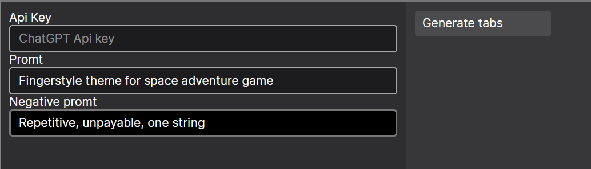
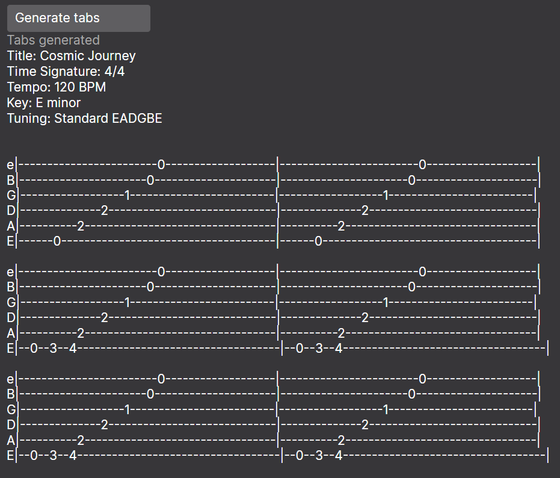

# Guitar tabs generator
An application that generates tablature for the guitar using ChatGPT api, using Avalonia UI and C#.
The application will allow convenient creation of tablature for the guitar for different situations, create a simple accompaniment or a melody for the main menu of the game.

```
The user will be able to configure the request, select the beat size, tune style, promt, negative promt, 
load the already created tabs in text format for further modification.
```

## Current state of the project
### Already created
- Web and Desktop UI
- Generating tabs by Promt

### In the process of developing
- Application core
  - Modifying existing tabs
  - Generation styles
  - Saving the generated tabs
  - Generation History
  - Configuration

## How to launch
1. Open project in your IDE

2. Select GuitarTabsGenerator.Desktop as build option


> Desktop version is only working version for now

3. Click Run button



4. Enter generation information and click "Generate Tabs"



5. Wait a few minutes


